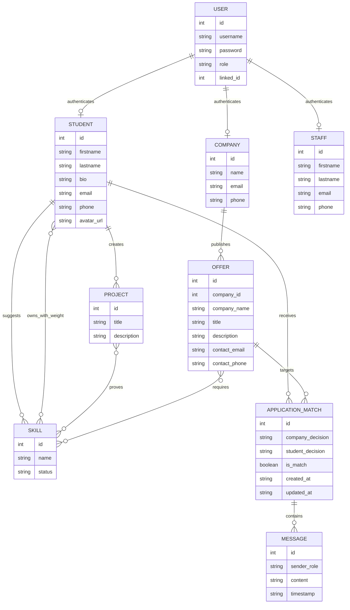

# Hexagone Talents

Full-stack MVP for Hexagone Talents: a FastAPI backend, a SQLite demo
database, and a React frontend for student/company matching.

The application lets companies publish offers, students manage weighted skills
and proof projects, both sides swipe each other, and matched users exchange
messages.

## Backend

```bash
python -m venv .venv
source .venv/bin/activate
pip install -r requirements.txt
python -m app.run_backend --reset-db --reload --port 8080
```
## On Windows on cmd
```bash
python -m venv .venv
.venv\Scripts\activate.bat
pip install -r requirements.txt
python -m app.run_backend --reset-db --reload --port 8080
```
The API is exposed under `http://localhost:8080/api`.

By default the demo database is refreshed at backend startup from
`app/db/schema.py` and `app/db/seed.py`. Use `--keep-db` to preserve local edits
between backend restarts:

```bash
python -m app.run_backend --keep-db --reload --port 8080
```

If you launch uvicorn directly, set `HEXAGONE_RESET_DB=0` to keep the DB or
`HEXAGONE_RESET_DB=1` to reset it.

## Frontend

The completed React interface lives in `frontend/`.

```bash
cd frontend
npm install
npm run dev
```

Open `http://localhost:5174/` and keep the FastAPI server running on port `8080`.
The frontend uses `VITE_API_BASE_URL` when provided, otherwise it calls `/api`.
In development, Vite proxies `/api` to `http://localhost:8080`, so an ngrok
tunnel to the Vite server can be used by other people without their browsers
calling their own `localhost`.

## Database MERISE

### MCD - Modele Conceptuel de Donnees



### MLD - Modele Logique de Donnees

- `users(id, username, password, role, linked_id)`
  - `username` is unique.
  - `role` is one of `ETUDIANT`, `ENTREPRISE`, `STAFF`.
  - `linked_id` points to `student(id)`, `company(id)`, or `staff(id)` depending on `role`.
- `student(id, firstname, lastname, bio, email, phone, avatar_url)`
- `company(id, name, email, phone)`
- `staff(id, firstname, lastname, email, phone)`
- `skill(id, name, status, suggested_by)`
  - `name` is unique.
  - `status` is one of `PENDING`, `APPROVED`, `REJECTED`.
  - `suggested_by` references `student(id)`.
- `student_skill(student_id, skill_id, weight)`
  - Composite primary key: `(student_id, skill_id)`.
  - `weight` must be between 1 and 100.
- `project(id, student_id, title, description)`
  - `student_id` references `student(id)`.
- `project_skill(project_id, skill_id)`
  - Composite primary key: `(project_id, skill_id)`.
- `offer(id, company_id, company_name, title, description, contact_email, contact_phone)`
  - `company_id` references `company(id)`.
- `offer_skill(offer_id, skill_id)`
  - Composite primary key: `(offer_id, skill_id)`.
- `application_match(id, offer_id, student_id, company_decision, student_decision, is_match, created_at, updated_at)`
  - Unique pair: `(offer_id, student_id)`.
  - Decisions are `LIKE` or `DISLIKE`.
  - `is_match = 1` only when both decisions are `LIKE`.
- `message(id, match_id, sender_role, content, timestamp)`
  - `match_id` references `application_match(id)`.
  - `sender_role` is one of `ETUDIANT`, `ENTREPRISE`, `STAFF`.

### Main Business Rules

- A student can save at most 5 skills.
- Saved student skill weights must total exactly 100 points.
- A project must be linked to at least one skill already owned by the student.
- Offers must require at least one approved skill.
- Companies can only list, inspect, match, and swipe on their own offers.
- A match is created only when the company and the student both like each other.
- Messages are attached to confirmed matches only.

### Reset the Demo Database

The local SQLite file is `hexagone_talents.db` and is ignored by git. To rebuild
it from scratch:

```bash
python -m app.run_backend --reset-db --reload --port 8080
```

## Structure

```text
app/
  api/
    dependencies.py      # Role/header based access control
    router.py            # Central API router
    routes/              # REST controllers grouped by domain
  core/                  # Config, shared types, database connection
  db/                    # SQLite schema creation and demo seed data
  schemas/               # Pydantic request contracts
  services/              # Business rules and SQL use cases
  main.py                # FastAPI application factory
```

## Demo Accounts

Use `POST /api/auth/login` or the login screen with one of these usernames.
The demo password is `password123`.

- Students: `antoine.dev` (`12`), `maxime.dev` (`15`), `lucie.dev` (`18`),
  `nathalie.dev` (`21`), `anais.dev` (`24`), `sophie.dev` (`27`),
  `julien.dev` (`30`), `clara.dev` (`33`), `maya.dev` (`36`),
  `hugo.dev` (`39`), `ines.dev` (`42`), `karim.dev` (`45`).
- Companies: `tech.solutions` (`201`), `innovate.labs` (`202`),
  `mobilio.team` (`203`), `data.hive` (`204`), `creative.studio` (`205`),
  `cloudworks` (`206`), `greenops` (`207`), `finovia` (`208`),
  `healthbridge` (`209`), `studio.atlas` (`210`).
- `staff` -> `STAFF`, user id `1`

For protected routes, send:

```http
X-User-Role: ETUDIANT | ENTREPRISE | STAFF
X-User-Id: <id>
```
