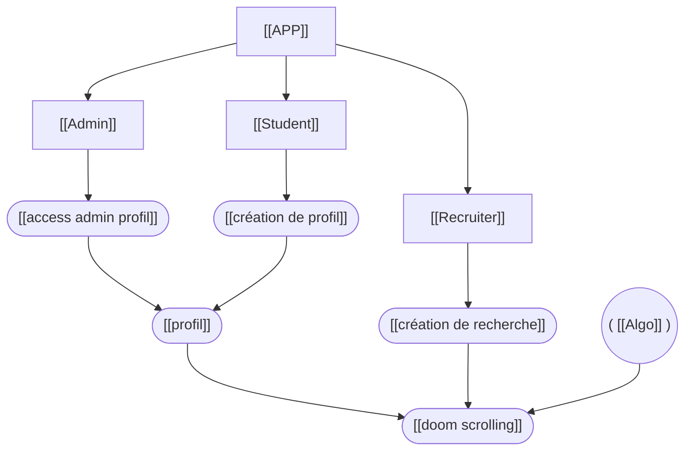

```mermaid  
graph TD
    APP["[[APP]]"]
    
    Admin["[[Admin]]"]
    Student["[[Student]]"]
    Recruiter["[[Recruiter]]"]
    
    AccessAdmin(["[[access admin profil]]"])
    CreateProfil(["[[création de profil]]"])
    Profil(["[[profil]]"])
    
    CreateSearch(["[[création de recherche]]"])
    DoomScrolling(["[[doom scrolling]]"])
    
    Algo(("( [[Algo]] )"))

    APP --> Admin
    APP --> Student
    APP --> Recruiter

    Admin --> AccessAdmin
    Student --> CreateProfil
    Recruiter --> CreateSearch

    AccessAdmin --> Profil
    CreateProfil --> Profil
    
    Profil --> DoomScrolling
    CreateSearch --> DoomScrolling
    Algo --> DoomScrolling
```